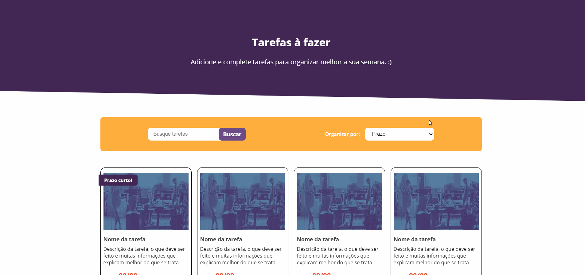

  <h1>Linx Projeto Agenda</h1>
  
Nesse projeto você conseguirá adicionar suas tarefas e ter um controle melhor de sua semana

  
Ter informações de quando você subiu alguma tarefa e seus prazos

  

  <h2>Quer achar alguma tarefa especifica? Utilize a barra de pesquisa ou os filtros disponiveis</h2>
  

  <h2>Apos concluir uma tarefa, ela mudara de estado e você sabera melhor o que resta ser feito</h2>
  

  <h1>Como rodar o projeto em sua maquina</h1>
  <h2>Você pode clonar esse repositorio e rodar o projeto em sua maquina</h2>
  <ul>
    <li>Como clonar um repositorio do GitHub: <a>https://docs.github.com/pt/github/creating-cloning-and-archiving-repositories/cloning-a-repository</a></li>
  </ul>
  <h2>Ou acessar o link abaixo para visualizar o projeto em uma hospedagem gratuita</h2>
  <ul>
    <li><a>https://linx-teste-five.vercel.app/</a></li>
  </ul>

